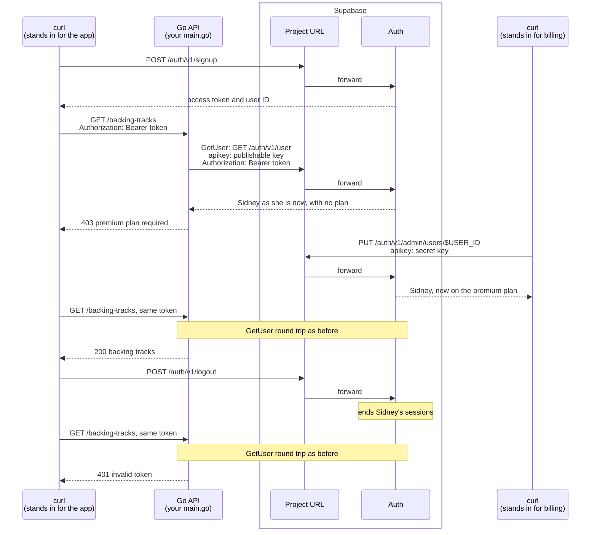

# Premium access walkthrough

<!-- cSpell:ignore Getenv -->

Imagine the practice-tracking app for musicians from the [RLS Walkthrough](RLS%20Walkthrough.md). Musicians on the premium plan can download backing tracks to play along with. The tracks are licensed audio that the app's Go API serves from its own storage, outside the Database. The app's billing system records each musician's plan in their Supabase Auth user, and the API must serve the tracks only to musicians on the premium plan.

This walkthrough builds that API. Row Level Security cannot guard the tracks, because they never pass through the Database, so the API has to decide for itself. A musician's access token carries a copy of their app metadata, but only as it stood when the token was issued ([JWT fields](https://supabase.com/docs/guides/auth/jwt-fields)). An upgrade or a cancellation reaches the token only when it refreshes, up to an hour later. So on every request the API asks Auth for the user as they are right now, with `GetUser`. The same round trip catches a musician who has signed out, which checking the token's signature alone cannot. In step 3, `curl` stands in for both the app and the billing system.

Step 3 makes three calls with one token, and each gets a different answer:



Only the API is written in Go, and it uses only the SDK's `auth` module, with no Database access. Sign-up and sign-out go straight to Auth, as they would from the app on a musician's device. The upgrade goes straight to Auth's admin endpoint with the project's secret key, as it would from the billing system's own server ([`updateUserById`](https://supabase.com/docs/reference/javascript/auth-admin-updateuserbyid) is the same call in supabase-js). All three are jobs for other parts of the app rather than the API, and the SDK has no calls for them anyway. The API holds only the publishable key.

## Prerequisites

- A [supported Go version](../README.md#supported-go-versions).
- The [Supabase CLI](https://supabase.com/docs/guides/local-development/cli/getting-started).
- Docker, or another container runtime the CLI supports, running before step 1.
- `curl` and `jq`, for the calls in step 3.

## 1. Start a local Supabase stack

In an empty folder, set up a local Supabase project and start it:

```bash
supabase init
supabase start
```

If the stack from the RLS Walkthrough is still running, reuse it. Skip both commands and run `supabase status` in that walkthrough's folder to print the values below.

The first start downloads the stack's container images, so it takes a few minutes. When the stack is up, the CLI prints its API URLs and authentication keys.
Export the _Project URL_ and the _Publishable key_, replacing `sb_publishable_...` with the full key value:

```bash
export SUPABASE_PROJECT_URL=http://127.0.0.1:54321
export SUPABASE_PUBLISHABLE_KEY=sb_publishable_...
```

If you need to then you can always run `supabase status` to print them again.

## 2. Write and run the API

In the same folder, create a Go module and add the SDK's `auth` module:

```bash
go mod init example.com/backing-tracks
go get github.com/supabase/supabase-go/auth
```

If you ran `supabase init` in this folder, `go mod init` will suggest running `go mod tidy`, because it takes the `supabase` folder as a sign of an existing project.
You can ignore the suggestion, since the `go get` after it adds everything the module needs.

Save this as `main.go`:

```go
package main

import (
	"encoding/json"
	"errors"
	"log"
	"net/http"
	"os"
	"strings"

	"github.com/supabase/supabase-go/auth"
)

// backingTrack describes one of the licensed tracks the API serves.
type backingTrack struct {
	Piece string `json:"piece"`
	Tempo int    `json:"tempo"`
}

// backingTracks stands in for the API's own storage, which the Database never sees.
var backingTracks = []backingTrack{
	{Piece: "Prelude in C", Tempo: 72},
	{Piece: "Moonlight Sonata", Tempo: 54},
}

func main() {
	projectURL := os.Getenv("SUPABASE_PROJECT_URL")
	publishableKey := os.Getenv("SUPABASE_PUBLISHABLE_KEY")
	client, err := auth.New(projectURL, publishableKey)
	if err != nil {
		log.Fatal(err)
	}

	http.HandleFunc("GET /backing-tracks", func(writer http.ResponseWriter, request *http.Request) {
		token, found := strings.CutPrefix(request.Header.Get("Authorization"), "Bearer ")
		if !found {
			log.Print("rejecting request without a bearer token")
			http.Error(writer, "missing bearer token", http.StatusUnauthorized)
			return
		}

		// Ask Auth for the user as they are now, not as the token describes them.
		user, err := client.GetUser(request.Context(), token)
		var authError *auth.Error
		switch {
		case errors.As(err, &authError) && authError.HTTPStatus < http.StatusInternalServerError:
			log.Printf("rejecting token: %v", err)
			http.Error(writer, "invalid token", http.StatusUnauthorized)
			return
		case err != nil:
			log.Printf("fetching user: %v", err)
			http.Error(writer, "auth unavailable", http.StatusBadGateway)
			return
		}

		if plan, _ := user.AppMetadata()["plan"].(string); plan != "premium" {
			log.Printf("user %s is not on the premium plan", user.ID())
			http.Error(writer, "premium plan required", http.StatusForbidden)
			return
		}

		log.Printf("serving backing tracks to user %s", user.ID())
		writer.Header().Set("Content-Type", "application/json")
		_ = json.NewEncoder(writer).Encode(backingTracks)
	})

	log.Print("listening on http://localhost:8080")
	log.Fatal(http.ListenAndServe("localhost:8080", nil))
}
```

The handler calls `GetUser` on every request. Auth checks the token and the session it belongs to, then returns the user's current record. The handler reads the plan from that record's app metadata, which users cannot change for themselves ([Row Level Security guide](https://supabase.com/docs/guides/database/postgres/row-level-security#authjwt)), so only a holder of the secret key such as the billing system can grant it.

Each failure gets its own status, so the app knows what to do next. A rejection from Auth, an `*auth.Error` with a status below 500, returns 401 and tells the app to sign the musician in again. Any other failure means Auth could not answer, so it returns 502 and the app can try again later. A musician without the premium plan gets 403, which tells the app to offer an upgrade.

Start the API and leave it running:

```bash
go run .
```

## 3. Call the API as a musician

Open a second terminal in the same folder and export the same two variables. Also export the _Secret key_ the CLI printed, which only the billing call in this step uses:

```bash
export SUPABASE_SECRET_KEY=sb_secret_...
```

The secret key bypasses Row Level Security and can change any user, so keep it on servers you control and out of source control. The API never sees it.

Sign up a musician, Sidney. The local stack does not ask new users to confirm their email address, so the response carries an access token right away:

```bash
SIGNUP_RESPONSE=$(curl -sS --fail-with-body "$SUPABASE_PROJECT_URL/auth/v1/signup" \
  -H "apikey: $SUPABASE_PUBLISHABLE_KEY" \
  -H "Content-Type: application/json" \
  -d '{"email": "sidney@example.com", "password": "example-password"}')
```

Extract Sidney's access token and user ID from the response:

```bash
ACCESS_TOKEN=$(echo "$SIGNUP_RESPONSE" | jq -r '.access_token // error(.msg // "no access token in the response")')
USER_ID=$(echo "$SIGNUP_RESPONSE" | jq -r '.user.id // error(.msg // "no user in the response")')
```

Each of these commands reports its own failure. `curl` names a connection problem or an HTTP error status, and `jq` prints the reason Auth gave, such as "User already registered" for an email address that is already signed up.

Ask for the backing tracks with Sidney's token:

```bash
curl -sS --fail-with-body -H "Authorization: Bearer $ACCESS_TOKEN" http://localhost:8080/backing-tracks
```

Sidney is not on the premium plan yet, so `curl` prints the API's reason and the HTTP status:

```text
premium plan required
curl: (22) The requested URL returned error: 403
```

Now upgrade Sidney, as the billing system would when she pays:

```bash
UPGRADE_RESPONSE=$(curl -sS --fail-with-body -X PUT "$SUPABASE_PROJECT_URL/auth/v1/admin/users/$USER_ID" \
  -H "apikey: $SUPABASE_SECRET_KEY" \
  -H "Content-Type: application/json" \
  -d '{"app_metadata": {"plan": "premium"}}')
```

Check her app metadata in the response. Auth merges the new `plan` key into what was already there:

```bash
echo "$UPGRADE_RESPONSE" | jq -c '.app_metadata // error(.msg // "no app metadata in the response")'
```

```json
{"plan":"premium","provider":"email","providers":["email"]}
```

Ask for the backing tracks again, with the same token:

```bash
curl -sS --fail-with-body -H "Authorization: Bearer $ACCESS_TOKEN" http://localhost:8080/backing-tracks
```

This time the API serves them:

```json
[{"piece":"Prelude in C","tempo":72},{"piece":"Moonlight Sonata","tempo":54}]
```

Sidney's token was issued before the upgrade and still carries no plan. The API sees the upgrade because it asked Auth.

Now sign Sidney out, as the app would when she taps sign out. By default, signing out ends every session the user has ([sign-out scopes](https://supabase.com/docs/guides/auth/signout)). The command prints nothing when it succeeds:

```bash
curl -sS --fail-with-body -X POST "$SUPABASE_PROJECT_URL/auth/v1/logout" \
  -H "apikey: $SUPABASE_PUBLISHABLE_KEY" \
  -H "Authorization: Bearer $ACCESS_TOKEN"
```

Ask for the backing tracks one last time, with the same token:

```bash
curl -sS --fail-with-body -H "Authorization: Bearer $ACCESS_TOKEN" http://localhost:8080/backing-tracks
```

```text
invalid token
curl: (22) The requested URL returned error: 401
```

The token has not expired and its signature is still valid, so an API that only checked it locally with `GetClaims` would still accept it. Auth rejects it because its session has ended, and the API's terminal logs Auth's reason, `session_not_found`.

Access tokens expire after an hour. For a fresh one, send the sign-up request body to `$SUPABASE_PROJECT_URL/auth/v1/token?grant_type=password` instead of the sign-up URL, then take the token from the response the same way. Signing in also starts a new session after signing out. When you are done, stop the API with Ctrl+C and the stack with `supabase stop`.

## Use a hosted project

The same API runs against a hosted Supabase project. Export the project's URL, publishable key and secret key instead. [Find your keys](https://supabase.com/docs/guides/getting-started/api-keys#find-your-keys) shows where to get them. Hosted projects ask new users to confirm their email address before they can sign in. Sign up with an address you can reach and follow the link in the confirmation email. Then get an access token and user ID by sending the same request body to `$SUPABASE_PROJECT_URL/auth/v1/token?grant_type=password`.

## Next steps

- The [`auth`](https://pkg.go.dev/github.com/supabase/supabase-go/auth) package documentation on pkg.go.dev compares `GetClaims` and `GetUser` and lists the errors each returns.
- The [RLS Walkthrough](RLS%20Walkthrough.md) shows the other way to verify a token, checking it locally with `GetClaims`, then letting Row Level Security decide what the user can read.
