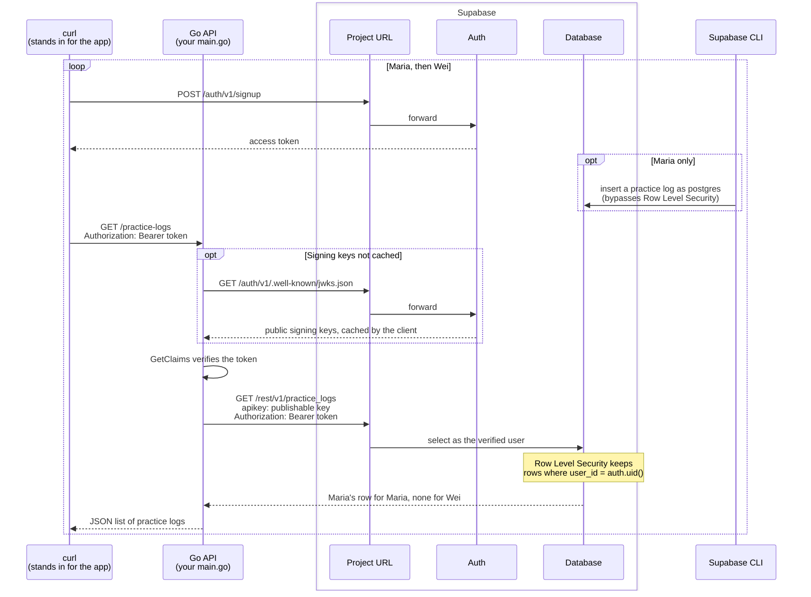

# RLS walkthrough

<!-- cSpell:ignore Getenv postgres uuid -->

Imagine a practice-tracking app for musicians. Musicians sign in to the app with Supabase Auth, and each practice session they log is a row in a `practice_logs` table. The app fetches those logs from an API written in Go, sending the musician's access token with every request. The API must return each musician's own logs and nobody else's.

This walkthrough builds that API. The API verifies each token with Auth before acting on it, so a forged or expired token never reaches the Database. It then queries the Database as the verified user, so [Row Level Security](https://supabase.com/docs/guides/database/postgres/row-level-security) returns only that user's rows. The Database enforces the isolation itself, so even a query the API gets wrong cannot return another musician's rows. In step 4, `curl` stands in for the app.

Step 4 runs the whole flow, once for Maria and once for Wei:



Only the API is written in Go, and it holds only the code the demonstration needs. Sign-up goes straight to Auth, as it would from the app on a musician's device. Signing users up is the app's job rather than the API's, and the SDK's `auth` module has no sign-up call anyway. It verifies tokens on the server. Maria's practice log goes in through `supabase db query`, which connects straight to Postgres as the `postgres` admin role. So the API needs only its one read, and the table needs only a read policy.

## Prerequisites

- A [supported Go version](../README.md#supported-go-versions).
- The [Supabase CLI](https://supabase.com/docs/guides/local-development/cli/getting-started), version 2.79.0 or later for `supabase db query`.
- Docker, or another container runtime the CLI supports, running before step 1.
- `curl` and `jq`, for the calls in step 4.

## 1. Start a local Supabase stack

In an empty folder, set up a local Supabase project and start it:

```bash
supabase init
supabase start
```

The first start downloads the stack's container images, so it takes a few minutes. When the stack is up, the CLI prints its API URLs and authentication keys.
Export the _Project URL_ and the _Publishable key_, replacing `sb_publishable_...` with the full key value:

```bash
export SUPABASE_PROJECT_URL=http://127.0.0.1:54321
export SUPABASE_PUBLISHABLE_KEY=sb_publishable_...
```

If you need to then you can always run `supabase status` to print them again.

## 2. Create a table with Row Level Security

Create a migration:

```bash
supabase migration new practice_logs
```

Paste this SQL into the new file.
The `supabase migration new` command tells you where it created it, which will be under `supabase/migrations/`:

```sql
create table public.practice_logs (
  id uuid primary key default gen_random_uuid(),
  user_id uuid not null references auth.users (id),
  piece text not null,
  minutes integer not null
);

alter table public.practice_logs enable row level security;

revoke all on table public.practice_logs from anon, authenticated;
grant select on table public.practice_logs to authenticated;

create policy "users can read their own practice logs"
on public.practice_logs for select
to authenticated
using ((select auth.uid()) = user_id);
```

The grant lets only signed-in users read the table, and the policy limits each of them to the rows they own. Apply the migration to the local database:

```bash
supabase migration up
```

## 3. Write and run the backend

In the same folder, create a Go module and add the SDK:

```bash
go mod init example.com/practice-logs
go get github.com/supabase/supabase-go/supabase
```

`go mod init` will suggest running `go mod tidy`, because it takes the `supabase` folder as a sign of an existing project.
You can ignore the suggestion, since the `go get` after it adds everything the module needs.

Save this as `main.go`:

```go
package main

import (
	"context"
	"encoding/json"
	"log"
	"net/http"
	"os"
	"strings"

	"github.com/supabase/supabase-go/postgrest"
	"github.com/supabase/supabase-go/supabase"
)

// practiceLog is a row of the practice_logs table.
type practiceLog struct {
	Piece   string `json:"piece"`
	Minutes int    `json:"minutes"`
}

func main() {
	projectURL := os.Getenv("SUPABASE_PROJECT_URL")
	publishableKey := os.Getenv("SUPABASE_PUBLISHABLE_KEY")
	client, err := supabase.New(projectURL, publishableKey)
	if err != nil {
		log.Fatal(err)
	}

	http.HandleFunc("GET /practice-logs", func(writer http.ResponseWriter, request *http.Request) {
		token, found := strings.CutPrefix(request.Header.Get("Authorization"), "Bearer ")
		if !found {
			http.Error(writer, "missing bearer token", http.StatusUnauthorized)
			return
		}

		claims, _, _, err := client.Auth().GetClaims(request.Context(), token)
		if err != nil {
			log.Printf("rejecting token: %v", err)
			http.Error(writer, "invalid token", http.StatusUnauthorized)
			return
		}
		log.Printf("serving practice logs to user %s", claims.Subject())

		// Query as the verified user, so Row Level Security returns only their rows.
		practiceLogs, _, err := postgrest.Collect(
			request.Context(),
			client.Database(),
			postgrest.From[practiceLog]("practice_logs").Select("piece, minutes"),
			postgrest.WithAccessTokenProvider(
				func(context.Context) (string, error) { return token, nil },
			),
		)
		if err != nil {
			log.Printf("querying practice logs: %v", err)
			http.Error(writer, "query failed", http.StatusBadGateway)
			return
		}

		writer.Header().Set("Content-Type", "application/json")
		_ = json.NewEncoder(writer).Encode(practiceLogs)
	})

	log.Print("listening on http://localhost:8080")
	log.Fatal(http.ListenAndServe("localhost:8080", nil))
}
```

The handler verifies each request's token with `GetClaims` before it touches the Database. The verified claims say who the user is. The handler then attaches the same token to the query. The client holds the publishable key, so the Database runs the query as that user and applies their Row Level Security policies. A secret key would bypass those policies.

Start the backend and leave it running:

```bash
go run .
```

## 4. Call the backend as a user

Open a second terminal in the same folder and export the same two variables. Then sign up a user. The local stack does not ask new users to confirm their email address, so the response carries an access token right away:

```bash
SIGNUP_RESPONSE=$(curl -sS --fail-with-body "$SUPABASE_PROJECT_URL/auth/v1/signup" \
  -H "apikey: $SUPABASE_PUBLISHABLE_KEY" \
  -H "Content-Type: application/json" \
  -d '{"email": "maria@example.com", "password": "example-password"}')
```

Extract Maria's access token from the response:

```bash
ACCESS_TOKEN=$(echo "$SIGNUP_RESPONSE" | jq -r '.access_token // error(.msg // "no access token in the response")')
```

Add a practice log for Maria. `supabase db query` runs SQL as the `postgres` admin role, which bypasses Row Level Security:

```bash
supabase db query "insert into public.practice_logs (user_id, piece, minutes)
select id, 'Prelude in C', 30 from auth.users where email = 'maria@example.com'"
```

Call the backend with Maria's token:

```bash
curl -sS --fail-with-body -H "Authorization: Bearer $ACCESS_TOKEN" http://localhost:8080/practice-logs
```

The response holds Maria's practice log, and the backend logs the user ID it verified:

```json
[{"piece":"Prelude in C","minutes":30}]
```

If the backend rejects the call, `curl` prints the backend's reason, such as "invalid token", followed by the HTTP error status.

Now sign up a second user, Wei:

```bash
SIGNUP_RESPONSE=$(curl -sS --fail-with-body "$SUPABASE_PROJECT_URL/auth/v1/signup" \
  -H "apikey: $SUPABASE_PUBLISHABLE_KEY" \
  -H "Content-Type: application/json" \
  -d '{"email": "wei@example.com", "password": "example-password"}')
```

Extract Wei's access token from the response:

```bash
OTHER_TOKEN=$(echo "$SIGNUP_RESPONSE" | jq -r '.access_token // error(.msg // "no access token in the response")')
```

And call the backend with their token:

```bash
curl -sS --fail-with-body -H "Authorization: Bearer $OTHER_TOKEN" http://localhost:8080/practice-logs
```

The policy hides Maria's row from Wei, so the list is empty:

```json
[]
```

Access tokens expire after an hour. For a fresh one, send the same request body to `$SUPABASE_PROJECT_URL/auth/v1/token?grant_type=password` instead of the sign-up URL, then take the token from the response the same way. Signing in also recovers a token for a user who is already signed up. When you are done, stop the backend with Ctrl+C and the stack with `supabase stop`.

## Use a hosted project

The same backend runs against a hosted Supabase project. Export the project's URL and publishable key instead. [Find your keys](https://supabase.com/docs/guides/getting-started/api-keys#find-your-keys) shows where to get them. Run the SQL from steps 2 and 4 in the dashboard's SQL Editor. Hosted projects ask new users to confirm their email address before they can sign in. Sign up with an address you can reach and follow the link in the confirmation email. Then get an access token by sending the same request body to `$SUPABASE_PROJECT_URL/auth/v1/token?grant_type=password`.

## Next steps

- The package documentation on pkg.go.dev has runnable examples throughout. Start with [`postgrest`](https://pkg.go.dev/github.com/supabase/supabase-go/postgrest) for filters, ordering, writes and Postgres function calls, then [`auth`](https://pkg.go.dev/github.com/supabase/supabase-go/auth) for each way token verification can fail.
- [`examples/`](../examples/) holds complete programs, including one that queries through the `postgrest` module alone and one that traces requests with OpenTelemetry.
